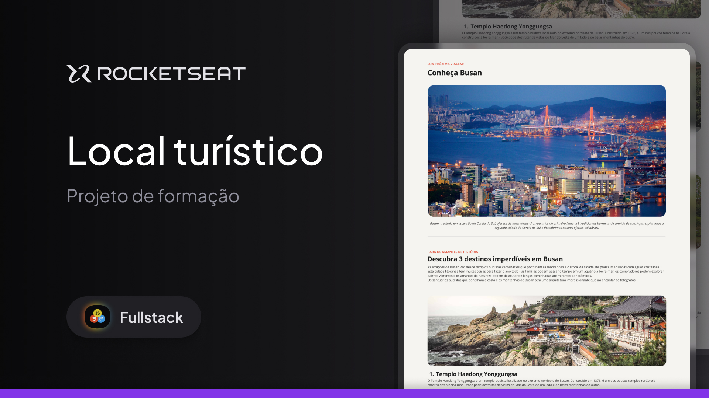
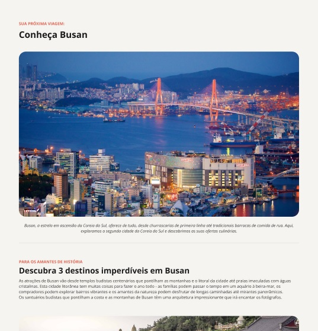

# 🌍 Local Turístico

## Destino: Busan, Coreia do Sul

<div align="center">
  
</div>

Este projeto é uma página estática desenvolvida com **HTML e CSS**, apresentando **Busan**, uma das cidades mais vibrantes e culturais da Coreia do Sul.

---

## 🧭 Descrição

O objetivo do projeto é simular uma apresentação informativa e atrativa sobre um local turístico, organizando o conteúdo de forma clara, responsiva e visualmente agradável — reforçando habilidades com HTML e CSS puros.

---

## ✨ Funcionalidades

- ✅ Estrutura semântica com seções bem definidas.
- 🖼️ Imagens temáticas representando o local.
- 📋 Informações organizadas com listas desordenadas.
- 🎨 Estilização com cores, pesos e espaçamentos ajustados.
- 🔤 Tipografia personalizada com Google Fonts.
- ❤️ Rodapé com assinatura estilizada.

---

## 🖼️ Prévia do Projeto

<div align="center">
  
</div>

---

## ⚙️ Tecnologias Utilizadas

- HTML5
- CSS3

---

## 📁 Estrutura de Pastas

```
local_turistico/
│
├── assets/
│ ├── busan.jpg
│ ├── favicon.svg
│ ├── heart.svg
│ ├── parque_yongdusan.jpg
│ ├── project_cover.jpg
│ ├── project.jpg
│ ├── templo_beomeo-sa.jpg
│ └── templo_haedong_yonggungsa.jpg
│
├── index.html
├── style.css
└── readme.md
```

---

## 📚 Aprendizados Aplicados

- Estruturação semântica com HTML5
- Criação de páginas temáticas com CSS puro
- Uso de listas para organizar conteúdo
- Aplicação de fontes externas (Google Fonts)
- Manipulação de cores e pesos de texto
- Boas práticas de espaçamento e responsividade
- Organização visual e hierarquia da informação

---

## ✍️ Autor

Desenvolvido por **Rocketseat**  
Adaptado e implementado por **William Milanez**

---

## 📄 Licença

Este projeto é de uso educacional e livre para fins de estudo e prática pessoal.
